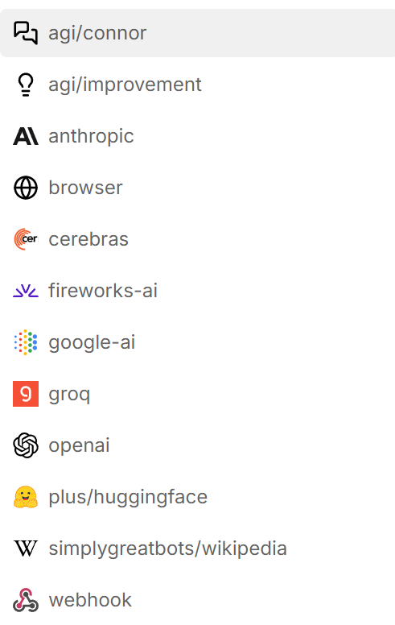
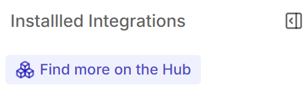

# Важно преди зареждане на чатбота в Botpress
Необходимо е да са изтеглени и ъпдейтнати до най-новата им версия всички интеграции по-долу. 

Изтеглят се от това меню:

Препоръчително е да изтеглите и Knowledge Base Optimizer
За интеграцията с HuggingFace в полето Language Models трябва да бъдат поставено това, за да се използват всички модели.
```Qwen/QwQ-32B-Preview, microsoft/Phi-3.5-mini-instruct, mistralai/Mixtral-8x7B-Instruct-v0.1, deepseek-ai/DeepSeek-R1, google/shieldgemma-27b, google/gemma-2-27b-it, meta-llama/Llama-3.1-405B-Instruct, meta-llama/Llama-3.3-70B-Instruct```
Необходимо е и в полето Access token да поставите вашия API ключ.
API ключовете са заменени с "API-KEY" от съображения за сигурност. Необходимо е да ги замените с API-тата си от HuggingFace и ImgBB.
